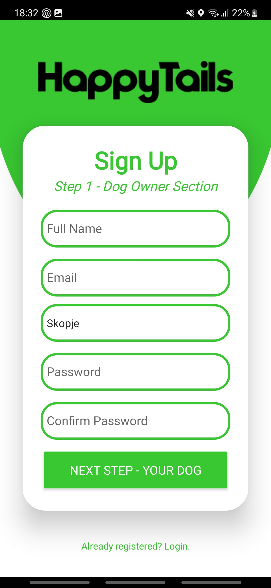
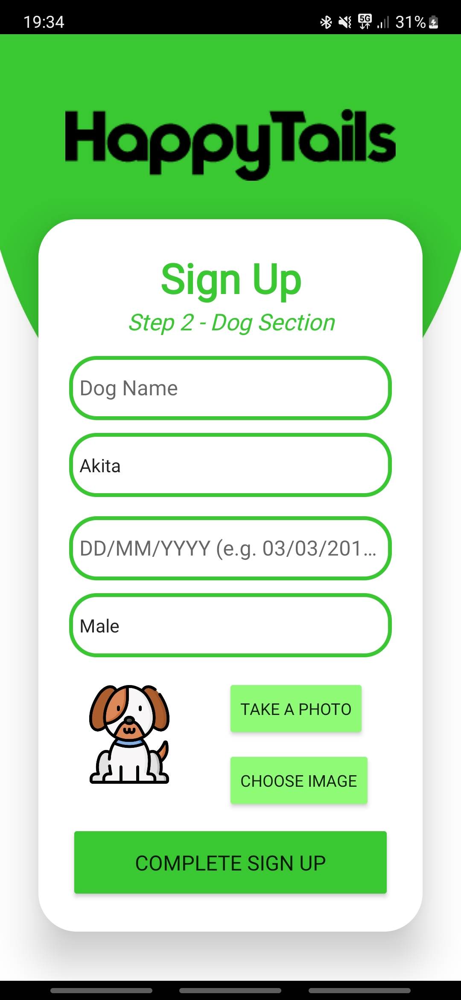
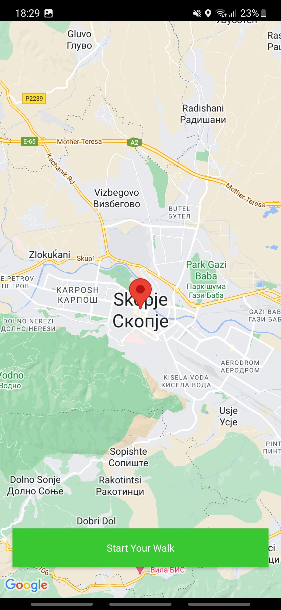
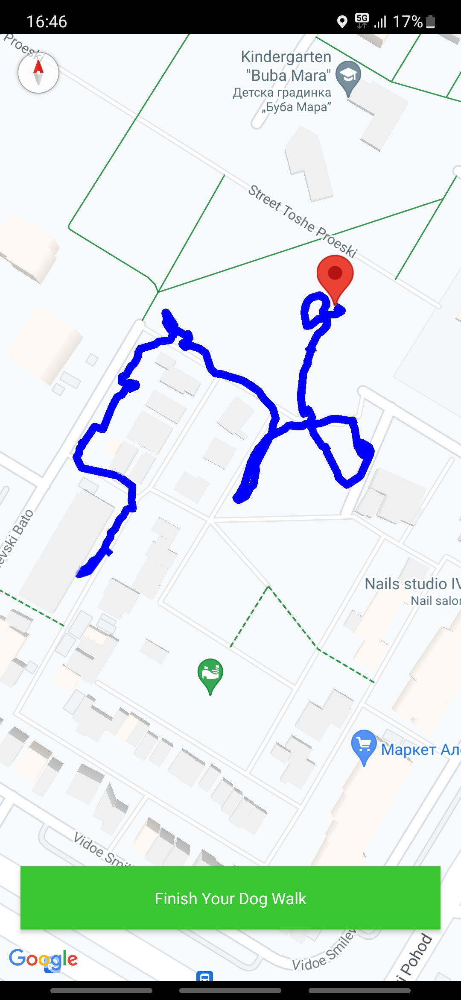
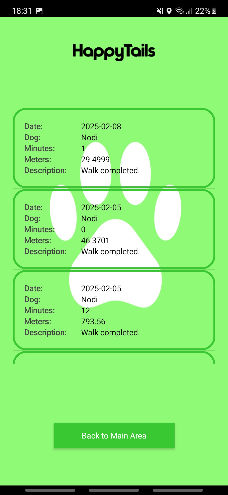
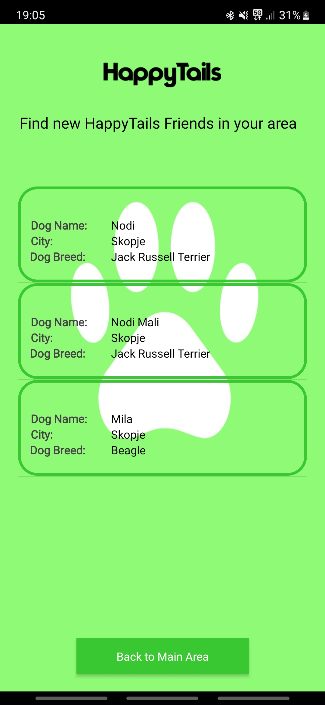
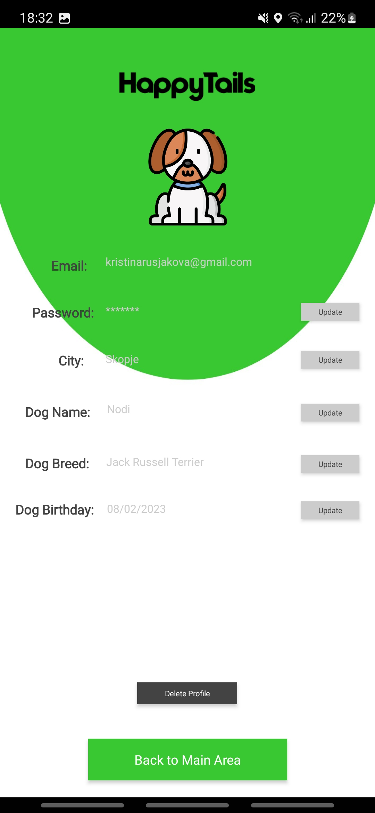

# HappyTails - A Dog Walking App
**Happy Tails** is an Android application developed in Android Studio using Java. The app allows dog owners to find other dogs nearby, track walks using Google Maps API, and store walk details in an SQLite database.

## Features and Functionalities
Login or Register


Login Page:


Register page 1: Enter Owner's information


Register page 2: Enter Dog's information


Track you walk using Google Maps



Dog walk summary page that displays date, time walked, distance walked, dog name


HappyTails friends page that displays current users in your city


Update your information page


## Installation
### **1. Clone the Repository**  
```sh
git clone https://github.com/yourusername/happy_tails.git
cd happy_tails
```

### **2. Open in Android Studio**
Open Android Studio
Click File>Open
Select the happy_tails folder

### **3. Set Up Google Maps API Key**
Go to Google Cloud Console and create a new project.
Enable the Google Maps SDK for Android.
Generate an API key and copy it.
Open AndroidManifest.xml and add:
```sh
<meta-data
    android:name="com.google.android.geo.API_KEY"
    android:value="YOUR_API_KEY_HERE"/>
```

### **4. Run the app**
